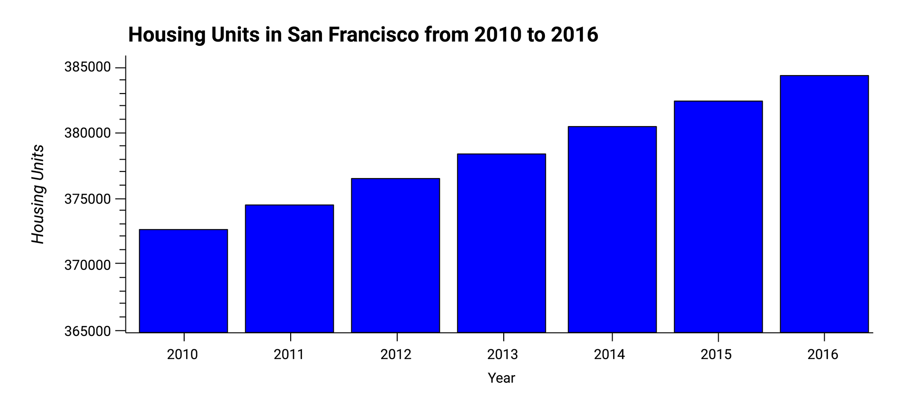

# Unit 6: Housing Rental Analysis for San Francisco

### Files

* [Houing Rental Analysis - DK](Starter_Code/san_francisco_housing_DK.ipynb)

### Resource Files

* [`housing_per_year` CSV File](Starter_Code/Resources/housing_per_year.csv)

* [`neighborhoods_coordinates` CSV File](Starter_Code/Resources/neighborhoods_coordinates.csv)

* [`sfo_neighborhoods_census_data` CSV File](Starter_Code/Resources/sfo_neighborhoods_census_data.csv)

### Site References

* [Code for formatting bar chart in Step 3 of "Calculate and plot the Housing Units per Year" sourced from stackoverflow](https://stackoverflow.com/questions/64338294/how-to-disable-scientific-notation-in-hvplot-plots)

---

### Instructions

Use the `san_francisco_housing.ipynb` notebook to visualize and analyze the real-estate data.
* Calculate and plot the housing units per year.
* Calculate and plot the average prices per square foot.
* Compare the average prices by neighborhood.
* Build an interactive neighborhood map.
* Compose your data story.

##### Calculate and Plot the Housing Units per Year

1. Use the `groupby` function to group the data by year. Aggregate the results by the `mean` of the groups.
2. Use the `hvplot` function to plot the `housing_units_by_year` DataFrame as a bar chart. Make the x-axis represent the `year` and the y-axis represent the `housing_units`.
3. Style and format the line plot to ensure a professionally styled visualization.
4. Note that your resulting plot should appear similar to the following image:

5. Answer the following question in the notebook:

    * What’s the overall trend in housing units over the period that you’re analyzing?

##### Calculate and Plot the Average Sale Prices per Square Foot
1. Group the data by year, and then average the results. What’s the lowest gross rent that’s reported for the years that the DataFrame includes?
2. Create a new DataFrame named `prices_square_foot_by_year` by filtering out the “housing_units” column. The new DataFrame should include the averages per year for only the sale price per square foot and the gross rent.
3. Use hvPlot to plot the `prices_square_foot_by_year` DataFrame as a line plot.
4. Style and format the line plot to ensure a professionally styled visualization.
5. Note that your resulting plot should appear similar to the following image:

6. Use both the `prices_square_foot_by_year` DataFrame and interactive plots to answer the following questions in the notebook:
    * Did any year experience a drop in the average sale price per square foot compared to the previous year?
    * If so, did the gross rent increase or decrease during that year?

##### Compare the Average Sale Prices by Neighborhood
1. Create a new DataFrame that groups the original DataFrame by year and neighborhood. Aggregate the results by the `mean` of the groups.
2. Filter out the “housing_units” column to create a DataFrame that includes only the `sale_price_sqr_foot` and `gross_rent` averages per year.
3. Create an interactive line plot with hvPlot that visualizes both `sale_price_sqr_foot` and `gross_rent`. Set the x-axis parameter to the year (`x="year"`). Use the `groupby` parameter to create an interactive widget for `neighborhood`.
4. Style and format the line plot to ensure a professionally styled visualization.
5. Note that your resulting plot should appear similar to the following image:

6. Use the interactive visualization to answer the following question in the notebook:

    * For the Anza Vista neighborhood, is the average sale price per square foot for 2016 more or less than the price that’s listed for 2012?

##### Build an Interactive Neighborhood Map

1. Read the `neighborhood_coordinates.csv` file from the `Resources` folder into the notebook, and create a DataFrame named `neighborhood_locations_df`. Be sure to set the `index_col` of the DataFrame as “Neighborhood”.
2. Using the original `sfo_data_df` Dataframe, create a DataFrame named `all_neighborhood_info_df` that groups the data by neighborhood. Aggregate the results by the `mean` of the group.
3. Review the two code cells that concatenate the `neighborhood_locations_df` DataFrame with the `all_neighborhood_info_df` DataFrame. Note that the first cell uses the [Pandas concat function](https://pandas.pydata.org/pandas-docs/stable/reference/api/pandas.concat.html) to create a DataFrame named `all_neighborhoods_df`. The second cell cleans the data and sets the “Neighborhood” column. Be sure to run these cells to create the `all_neighborhoods_df` DataFrame, which you’ll need to create the geospatial visualization.

4. Using hvPlot with GeoViews enabled, create a `points` plot for the `all_neighborhoods_df` DataFrame. Be sure to do the following:
    * Set the `size` parameter to “sale_price_sqr_foot”.
    * Set the `color` parameter to “gross_rent”.
    * Set the `frame_width` parameter to 700.
    * Set the `frame_height` parameter to 500.
    * Include a descriptive title.

Note that your resulting plot should appear similar to the following image:

5. Use the interactive map to answer the following question in the notebook:

    * Which neighborhood has the highest gross rent, and which has the highest sale price per square foot?

##### Compose Your Data Story

Based on the visualizations that you created, answer the following questions in the notebook:

* How does the trend in rental income growth compare to the trend in sales prices? Does this same trend hold true for all the neighborhoods across San Francisco?

* What insights can you share with your company about the potential one-click, buy-and-rent strategy that they're pursuing? Do neighborhoods exist that you would suggest for investment, and why?